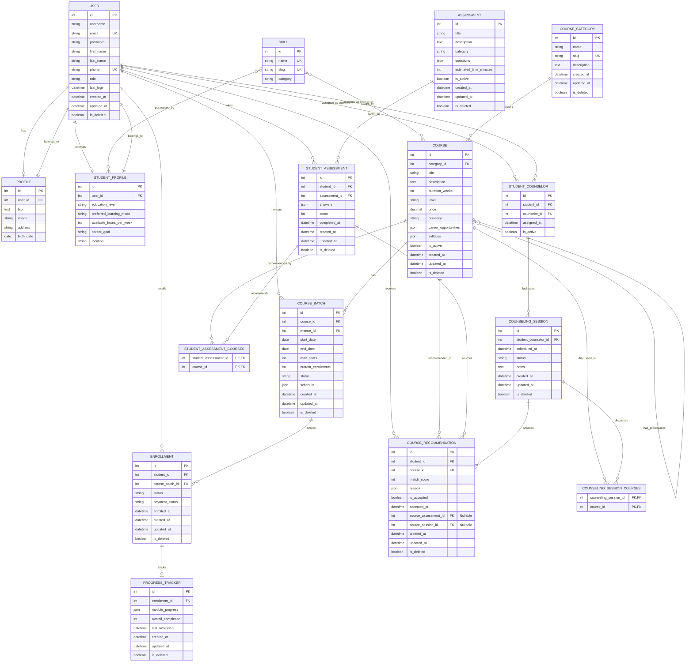

# Database Schema — Student Guidance System

> Complete database documentation with ER diagrams, models, and relationships

---

## Entity Relationship Diagram



---
## Model Descriptions

### 1. User (`authentication.User`)
Custom user model extending Django's `AbstractUser` and `BaseModel`.

| Field | Type | Constraints | Description |
|-------|------|-------------|-------------|
| `id` | AutoField | PK | Unique identifier |
| `username` | CharField(150) | Unique (when not deleted) | Username for display |
| `email` | EmailField | Unique | Primary login identifier |
| `password` | CharField | Hashed | Django-managed password |
| `first_name` | CharField(150) | Required | First name |
| `last_name` | CharField(150) | Required | Last name |
| `phone` | CharField(20) | Unique (when not deleted) | Nepal phone format |
| `role` | CharField(20) | Choices | `super_admin`, `student`, `staff`, `mentor` |
| `last_login` | DateTimeField | Nullable | Last login timestamp |
| `created_at` | DateTimeField | Auto | Creation timestamp |
| `updated_at` | DateTimeField | Auto | Last update timestamp |
| `is_deleted` | BooleanField | Default=False | Soft-delete flag |
| `created_by` | ForeignKey | Nullable | User who created this record |
| `updated_by` | ForeignKey | Nullable | User who last updated |

**Constraints**:
- Unique username when `is_deleted=False`
- Unique phone when `is_deleted=False` and phone is not empty
- `USERNAME_FIELD = 'email'`
- `REQUIRED_FIELDS = ['username', 'first_name', 'last_name']`

---

### 2. Profile (`authentication.Profile`)
Extended user profile information.

| Field | Type | Constraints | Description |
|-------|------|-------------|-------------|
| `id` | AutoField | PK | Unique identifier |
| `user` | OneToOneField | FK → User | Linked user account |
| `bio` | TextField(500) | Blank | Short biography |
| `image` | ImageField | Upload to `profiles/` | Profile picture |
| `address` | CharField(100) | — | Physical address |
| `birth_date` | CustomDateField | Nullable | Date of birth |

---

### 3. StudentProfile (`counseling.StudentProfile`)
Extended profile specifically for counseling and recommendations.

| Field | Type | Constraints | Description |
|-------|------|-------------|-------------|
| `id` | AutoField | PK | Unique identifier |
| `user` | OneToOneField | FK → User | Linked student account |
| `education_level` | CharField | Choices | `+2`, `Bachelor`, `Master`, `Other` |
| `preferred_learning_mode` | CharField | Choices | `online`, `offline`, `hybrid` |
| `available_hours_per_week` | PositiveIntegerField | — | Study time availability |
| `career_goal` | CharField | — | Target career (e.g., "Full Stack Developer") |
| `location` | CharField | — | City/region in Nepal |
| `created_at` | DateTimeField | Auto | Creation timestamp |
| `updated_at` | DateTimeField | Auto | Last update timestamp |
| `is_deleted` | BooleanField | Default=False | Soft-delete flag |

**Many-to-Many**: `skills` → `Skill` (Replaces previous JSON field for better querying and recommendation matching)

---

### 4. StudentCounselor (`counseling.StudentCounselor`)
Mapping table to track which counselor is assigned to which student over time.

| Field | Type | Constraints | Description |
|-------|------|-------------|-------------|
| `id` | AutoField | PK | Unique identifier |
| `student` | ForeignKey | FK → User | The student user |
| `counselor` | ForeignKey | FK → User | The staff/counselor user |
| `assigned_at` | DateTimeField | Auto | When the assignment was made |
| `is_active` | BooleanField | Default=True | Is this the current active counselor? |
| `created_at` | DateTimeField | Auto | Creation timestamp |
| `updated_at` | DateTimeField | Auto | Last update timestamp |
| `is_deleted` | BooleanField | Default=False | Soft-delete flag |

---

### 5. Skill (`courses.Skill`)
Master table for skills to allow relational mapping and efficient querying (replaces JSON fields).

| Field | Type | Constraints | Description |
|-------|------|-------------|-------------|
| `id` | AutoField | PK | Unique identifier |
| `name` | CharField(100) | Unique | Skill name (e.g., "Python", "Communication") |
| `slug` | SlugField | Unique | URL-friendly identifier |
| `category` | CharField(50) | — | e.g., `technical`, `soft_skill` |
| `created_at` | DateTimeField | Auto | Creation timestamp |
| `updated_at` | DateTimeField | Auto | Last update timestamp |
| `is_deleted` | BooleanField | Default=False | Soft-delete flag |

---

### 6. CourseCategory (`courses.CourseCategory`)
Categories for organizing courses.

| Field | Type | Constraints | Description |
|-------|------|-------------|-------------|
| `id` | AutoField | PK | Unique identifier |
| `name` | CharField(100) | — | Display name (e.g., "Web Development") |
| `slug` | SlugField | Unique | URL-friendly identifier |
| `description` | TextField | — | Category description |
| `created_at` | DateTimeField | Auto | Creation timestamp |
| `updated_at` | DateTimeField | Auto | Last update timestamp |
| `is_deleted` | BooleanField | Default=False | Soft-delete flag |

**Pre-defined Categories**:
| ID | Name | Slug |
|----|------|------|
| 1 | Web Development | `web-development` |
| 2 | Data Science | `data-science` |
| 3 | Cybersecurity | `cybersecurity` |
| 4 | Cloud Computing | `cloud-computing` |
| 5 | UI/UX Design | `ui-ux-design` |
| 6 | Digital Marketing | `digital-marketing` |
| 7 | Mobile Development | `mobile-development` |

---

### 7. Course (`courses.Course`)
Individual course offerings.

| Field | Type | Constraints | Description |
|-------|------|-------------|-------------|
| `id` | AutoField | PK | Unique identifier |
| `category` | ForeignKey | FK → CourseCategory | Course category |
| `title` | CharField(200) | — | Course title |
| `description` | TextField | — | Full course description |
| `duration_weeks` | PositiveIntegerField | — | Course length (typically 8-12) |
| `level` | CharField(20) | Choices | `beginner`, `intermediate`, `advanced` |
| `price` | DecimalField | Max digits 10, 2 decimals | Course fee in NPR |
| `currency` | CharField(3) | Default=NPR | Currency code |
| `career_opportunities` | JSONField | Default=list | Job roles after course |
| `syllabus` | JSONField | Default=list | Weekly curriculum breakdown |
| `is_active` | BooleanField | Default=True | Visibility flag |
| `created_at` | DateTimeField | Auto | Creation timestamp |
| `updated_at` | DateTimeField | Auto | Last update timestamp |
| `is_deleted` | BooleanField | Default=False | Soft-delete flag |

**Many-to-Many Relationships**:
- `skills_gained` → `Skill` (Replaces previous JSON field)
- `prerequisites` → `Course` (Self-referential M2M, replaces JSON field to ensure referential integrity)

**Example `syllabus` JSON**:
```json
[
  {"week": 1, "topic": "JavaScript ES6+", "description": "Arrow functions, async/await"},
  {"week": 2, "topic": "Node.js & Express", "description": "Building REST APIs"}
]
```

---

### 8. CourseBatch (`courses.CourseBatch`)
Scheduled instances of a course.

| Field | Type | Constraints | Description |
|-------|------|-------------|-------------|
| `id` | AutoField | PK | Unique identifier |
| `course` | ForeignKey | FK → Course | Parent course |
| `mentor` | ForeignKey | FK → User | Instructor for this batch |
| `start_date` | DateField | — | Batch start date |
| `end_date` | DateField | — | Batch end date |
| `max_seats` | PositiveIntegerField | — | Maximum students |
| `current_enrollments` | PositiveIntegerField | Default=0 | Currently enrolled |
| `status` | CharField(20) | Choices | `upcoming`, `ongoing`, `completed` |
| `schedule` | JSONField | — | Class days and times |
| `created_at` | DateTimeField | Auto | Creation timestamp |
| `updated_at` | DateTimeField | Auto | Last update timestamp |
| `is_deleted` | BooleanField | Default=False | Soft-delete flag |

**Example `schedule` JSON**:
```json
{
  "days": ["Sunday", "Tuesday", "Thursday"],
  "time": "07:00 - 09:00",
  "timezone": "Asia/Kathmandu"
}
```

---

### 9. Assessment (`assessment.Assessment`)
Skill/interest quizzes for students.

| Field | Type | Constraints | Description |
|-------|------|-------------|-------------|
| `id` | AutoField | PK | Unique identifier |
| `title` | CharField(200) | — | Assessment title |
| `description` | TextField | — | What this assessment measures |
| `category` | CharField(50) | — | `career_guidance`, `aptitude`, `skill` |
| `questions` | JSONField | — | Question definitions |
| `estimated_time_minutes` | PositiveIntegerField | — | Expected completion time |
| `is_active` | BooleanField | Default=True | Visibility flag |
| `created_at` | DateTimeField | Auto | Creation timestamp |
| `updated_at` | DateTimeField | Auto | Last update timestamp |
| `is_deleted` | BooleanField | Default=False | Soft-delete flag |

**Question JSON Format**:
```json
{
  "questions": [
    {
      "id": 1,
      "text": "Do you enjoy solving logic puzzles?",
      "type": "single_choice",
      "options": [
        {
          "id": "a",
          "text": "Yes, I love them!",
          "value": "yes_love",
          "weights": {"programming": 10, "data_analysis": 5}
        },
        {
          "id": "b",
          "text": "Sometimes",
          "value": "sometimes",
          "weights": {"programming": 5, "design": 3}
        }
      ]
    }
  ]
}
```

---

### 10. StudentAssessment (`assessment.StudentAssessment`)
A student's completed assessment with results.

| Field | Type | Constraints | Description |
|-------|------|-------------|-------------|
| `id` | AutoField | PK | Unique identifier |
| `student` | ForeignKey | FK → User | Student who took it |
| `assessment` | ForeignKey | FK → Assessment | Which assessment |
| `answers` | JSONField | — | Submitted answers |
| `score` | PositiveIntegerField | — | Overall score (0-100) |
| `completed_at` | DateTimeField | Auto | Completion timestamp |
| `created_at` | DateTimeField | Auto | Creation timestamp |
| `updated_at` | DateTimeField | Auto | Last update timestamp |
| `is_deleted` | BooleanField | Default=False | Soft-delete flag |

**Many-to-Many**: `recommended_courses` → `Course` (via `StudentAssessmentCourses` junction table)

**Example `answers` JSON**:
```json
[
  {"question_id": 1, "selected_option": "yes_love"},
  {"question_id": 2, "selected_option": "web_dev"}
]
```

---

### 11. CounselingSession (`counseling.CounselingSession`)
Scheduled counseling appointments.

| Field | Type | Constraints | Description |
|-------|------|-------------|-------------|
| `id` | AutoField | PK | Unique identifier |
| `student_counselor` | ForeignKey | FK → StudentCounselor | Linked mapping of student & counselor |
| `scheduled_at` | DateTimeField | — | Appointment date/time |
| `status` | CharField(20) | Choices | `scheduled`, `completed`, `cancelled` |
| `notes` | TextField | Blank | Counselor notes |
| `created_at` | DateTimeField | Auto | Creation timestamp |
| `updated_at` | DateTimeField | Auto | Last update timestamp |
| `is_deleted` | BooleanField | Default=False | Soft-delete flag |

**Many-to-Many**: `recommended_courses` → `Course` (via `CounselingSessionCourses` junction table)

---

### 12. CourseRecommendation (`counseling.CourseRecommendation`)
Rule-based or AI-generated course suggestions for students.

| Field | Type | Constraints | Description |
|-------|------|-------------|-------------|
| `id` | AutoField | PK | Unique identifier |
| `student` | ForeignKey | FK → User | Target student |
| `course` | ForeignKey | FK → Course | Recommended course |
| `match_score` | PositiveIntegerField | 0-100 | Algorithm match percentage |
| `reason` | JSONField | — | Why this course was recommended |
| `is_accepted` | BooleanField | Default=False | Did student accept? |
| `accepted_at` | DateTimeField | Nullable | When accepted |
| `source_assessment` | ForeignKey | FK → StudentAssessment, Nullable | Traceability: Recommended because of this assessment |
| `source_session` | ForeignKey | FK → CounselingSession, Nullable | Traceability: Recommended during this session |
| `created_at` | DateTimeField | Auto | Creation timestamp |
| `updated_at` | DateTimeField | Auto | Last update timestamp |
| `is_deleted` | BooleanField | Default=False | Soft-delete flag |

**Example `reason` JSON**:
```json
{
  "skill_alignment": "Your programming aptitude (90%) aligns with course requirements",
  "interest_match": "You showed high interest in web development",
  "career_goal": "Matches your goal of becoming a Full Stack Developer",
  "market_demand": "High demand for MERN developers in Nepal"
}
```

---

### 13. Enrollment (`enrollment.Enrollment`)
Student enrollment in a course batch.

| Field | Type | Constraints | Description |
|-------|------|-------------|-------------|
| `id` | AutoField | PK | Unique identifier |
| `student` | ForeignKey | FK → User | Enrolled student |
| `course_batch` | ForeignKey | FK → CourseBatch | Specific batch |
| `status` | CharField(20) | Choices | `pending`, `confirmed`, `completed`, `cancelled` |
| `payment_status` | CharField(20) | Choices | `pending`, `completed`, `refunded`, `failed` |
| `enrolled_at` | DateTimeField | Auto | Enrollment timestamp |
| `created_at` | DateTimeField | Auto | Creation timestamp |
| `updated_at` | DateTimeField | Auto | Last update timestamp |
| `is_deleted` | BooleanField | Default=False | Soft-delete flag |

---

### 14. ProgressTracker (`enrollment.ProgressTracker`)
Learning progress for an enrollment.

| Field | Type | Constraints | Description |
|-------|------|-------------|-------------|
| `id` | AutoField | PK | Unique identifier |
| `enrollment` | OneToOneField | FK → Enrollment | Linked enrollment |
| `module_progress` | JSONField | Default=list | Module completion status |
| `overall_completion` | PositiveIntegerField | Default=0 | Percentage complete (0-100) |
| `last_accessed` | DateTimeField | Nullable | Last study session |
| `created_at` | DateTimeField | Auto | Creation timestamp |
| `updated_at` | DateTimeField | Auto | Last update timestamp |
| `is_deleted` | BooleanField | Default=False | Soft-delete flag |

**Example `module_progress` JSON**:
```json
{
  "modules": [
    {
      "name": "JavaScript ES6+ Review",
      "completed": true,
      "completed_at": "2026-07-18T10:00:00Z",
      "duration_hours": 6
    },
    {
      "name": "Node.js & Express",
      "completed": false,
      "completed_at": null,
      "duration_hours": 8
    }
  ]
}
```

---

## Relationship Summary

| Primary Model | Relationship | Related Model | Type |
|--------------|--------------|---------------|------|
| User | has | Profile | One-to-One |
| User | has | StudentProfile | One-to-One |
| User | takes | StudentAssessment | One-to-Many |
| User | requests | CounselingSession | One-to-Many (via StudentCounselor) |
| User | enrolls | Enrollment | One-to-Many |
| User | receives | CourseRecommendation | One-to-Many |
| User | mentors | CourseBatch | One-to-Many |
| StudentProfile | possesses | Skill | Many-to-Many |
| CourseCategory | contains | Course | One-to-Many |
| Course | has | CourseBatch | One-to-Many |
| Course | has_prerequisite | Course | Many-to-Many (Self-referential) |
| Course | taught_in | Skill | Many-to-Many |
| Course | recommended_in | CourseRecommendation | One-to-Many |
| Course | discussed_in | CounselingSession | Many-to-Many |
| Course | recommended_by | StudentAssessment | Many-to-Many |
| CourseBatch | enrolls | Enrollment | One-to-Many |
| Enrollment | tracks | ProgressTracker | One-to-One |
| Assessment | taken_as | StudentAssessment | One-to-Many |
| StudentCounselor | facilitates | CounselingSession | One-to-Many |
| StudentAssessment | sources | CourseRecommendation | One-to-Many |
| CounselingSession | sources | CourseRecommendation | One-to-Many |

---

## Soft Delete Behavior

All models extend `BaseModel` which implements soft-delete:

- **Delete**: Sets `is_deleted = True` instead of removing from database
- **Query**: Default manager (`objects`) excludes `is_deleted=True` records
- **Restore**: Set `is_deleted = False` to recover
- **Admin**: Use `all_objects` manager to see deleted records

**Why Soft Delete?**
- Preserve enrollment history even if course is "deleted"
- Allow data recovery for accidental deletions
- Maintain referential integrity for historical records
- Audit trail compliance

---

## Indexes

| Model | Field(s) | Type | Purpose |
|-------|----------|------|---------|
| User | `is_deleted` | Boolean | Soft-delete filtering |
| User | `email` | Unique | Login lookup |
| User | `username` | Conditional Unique | Display name uniqueness |
| Course | `category` | Foreign Key | Category filtering |
| Course | `is_active`, `is_deleted` | Composite | Active course listing |
| CourseBatch | `course`, `status` | Composite | Batch lookup |
| Enrollment | `student`, `status` | Composite | Student enrollment list |
| Enrollment | `course_batch` | Foreign Key | Batch enrollment count |
| StudentAssessment | `student`, `assessment` | Composite | Prevent duplicate |
| CourseRecommendation | `student`, `is_accepted` | Composite | Active recommendations |

---

## Data Integrity Rules

1. **Enrollment Constraints**:
   - Cannot enroll in a batch with `status=completed`
   - Cannot exceed `max_seats` of a batch
   - One enrollment per student per batch

2. **Assessment Constraints**:
   - One `StudentAssessment` per student per `Assessment`
   - `score` calculated automatically on submission

3. **Counseling Constraints**:
   - Only staff users can be assigned as `counselor` in `StudentCounselor`
   - `scheduled_at` must be in the future when created

4. **Recommendation Constraints**:
   - `match_score` auto-calculated (0-100)
   - Once `is_accepted=True`, cannot be un-accepted

5. **Prerequisite Constraints**:
   - A course cannot be a prerequisite of itself (prevents infinite loops in self-referential M2M).

---

*Document Version: 1.1 | Last Updated: 2026-07-14*
```