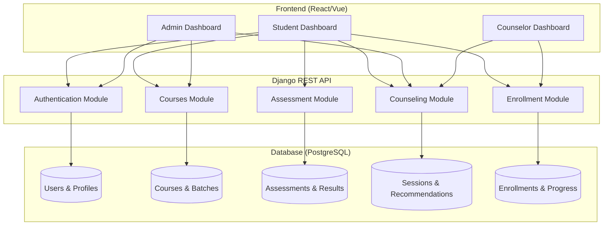
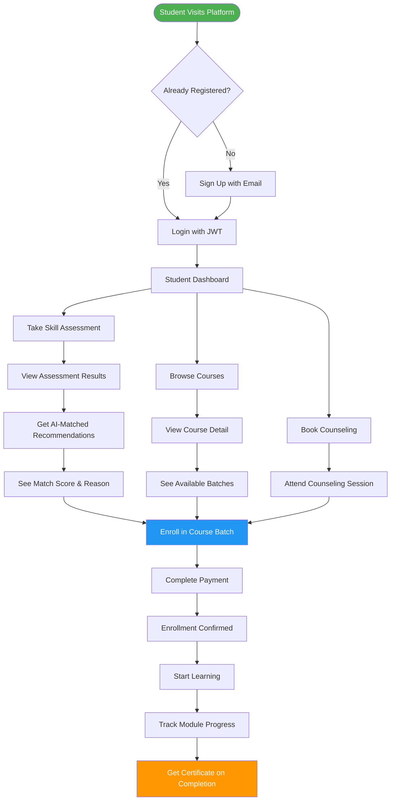

# Student Guidance System — Course Counseling Platform

> **Replacing Manual Counseling with Intelligent Course Recommendations**
> Inspired by SkillsShikya & BoardWays Nepal | Short-term Courses (2-3 Months)

---

## Table of Contents

1. [Vision & Objectives](#1-vision--objectives)
2. [System Architecture](#2-system-architecture)
3. [Student Journey Flow](#3-student-journey-flow)
4. [Module Breakdown](#4-module-breakdown)
5. [Tech Stack](#5-tech-stack)
6. [Project Structure](#6-project-structure)
7. [Nepal Ed-Tech Context](#7-nepal-ed-tech-context)

---

## 1. Vision & Objectives

### The Problem
In Nepal, students who want to learn job-ready skills (MERN Stack, Machine Learning, Cybersecurity, etc.) currently rely on **manual counseling** at institutes:
- Visiting physical centers to ask about courses
- Long queues to meet counselors
- No personalized recommendations based on skills/background
- Difficulty tracking which course fits their career goals
- No way to compare batches, schedules, or progress

### Our Solution
An **automated Course Counseling System** that:
- Lets students register and take a quick skill/interest assessment
- Recommends the best-fit courses using a match-score algorithm
- Allows booking counseling sessions with staff (optional, for complex cases)
- Shows course catalog with batch schedules, pricing, and syllabus
- Handles enrollment and tracks learning progress
- Replaces 80% of manual counseling with smart automation

### Target Audience
| Segment | Description |
|---------|-------------|
| +2 Graduates | Looking for job-oriented courses after high school |
| College Students | Want to add technical skills alongside their degree |
| Career Switchers | Professionals moving to IT/Data/Cyber fields |
| Fresh Graduates | Need practical skills not taught in university |

### Course Categories (2-3 Months)
- **Web Development**: MERN Stack, Django, Next.js
- **Data Science**: Python for Data Science, Machine Learning Basics
- **Cybersecurity**: Ethical Hacking, Network Security
- **Cloud Computing**: AWS Fundamentals, DevOps Basics
- **UI/UX Design**: Figma, User Research, Prototyping
- **Digital Marketing**: SEO, Social Media, Content Strategy
- **Mobile Development**: Flutter, React Native

---

## 2. System Architecture



### Architecture Layers

| Layer | Technology | Purpose |
|-------|-----------|---------|
| **Presentation** | React/Vue.js (separate repo) | Student, Admin, Counselor UIs |
| **API Gateway** | Django REST Framework | RESTful API endpoints |
| **Authentication** | JWT (SimpleJWT) | Token-based auth, blacklisting |
| **Business Logic** | Django Apps (5 modules) | Courses, Assessment, Counseling, Enrollment, Auth |
| **Data Layer** | PostgreSQL + Django ORM | Persistent storage with soft-delete |
| **Media Storage** | Local filesystem (dev) / S3 (prod) | Profile images, course thumbnails |

---

## 3. Student Journey Flow



### Detailed Flow Steps

| Step | Action | System Response |
|------|--------|-----------------|
| 1 | Student registers with email, phone, education level | Account created, JWT tokens returned |
| 2 | Student takes 10-15 question assessment | Answers stored, score calculated |
| 3 | System analyzes answers + profile | Match-score algorithm runs |
| 4 | Student sees ranked course recommendations | Top 3-5 courses with match % and reasons |
| 5 | Student can book counseling (optional) | Session scheduled with available staff |
| 6 | Student selects course and batch | Enrollment record created |
| 7 | Student completes payment | Enrollment status: confirmed |
| 8 | Student accesses course materials | Progress tracking begins |
| 9 | Student updates module completion | Overall % calculated automatically |
| 10 | Course completed | Certificate generated, progress archived |

---

## 4. Module Breakdown

### 4.1 Authentication Module (`authentication`)

**Purpose**: User registration, login, logout, profile management

**Models**:
- `User` — Custom user (email-based, roles: super_admin/student/staff)
- `Profile` — Extended user info (bio, image, address, birth date)

**Key Features**:
- JWT token authentication (access: 15 min, refresh: 7 days)
- Token blacklisting on logout
- Role-based access control
- Soft-delete enabled (BaseModel)

**API Endpoints**:
| Method | Endpoint | Description | Auth |
|--------|----------|-------------|------|
| POST | `/api/auth/register/` | Register new student | Public |
| POST | `/api/auth/login/` | Obtain JWT tokens | Public |
| POST | `/api/auth/logout/` | Blacklist refresh token | Required |
| GET | `/api/auth/me/` | Get current user profile | Required |
| PUT | `/api/auth/me/` | Update profile | Required |

---

### 4.2 Courses Module (`courses`)

**Purpose**: Course catalog management, batch scheduling, syllabus

**Models**:
- `CourseCategory` — Web Development, Data Science, Cybersecurity, etc.
- `Course` — Title, description, duration, level, price, syllabus, skills gained, career opportunities
- `CourseBatch` — Start/end dates, max seats, schedule, enrollment count, status

**Key Features**:
- Browse courses by category
- View course details with full syllabus
- See upcoming/ongoing batches
- Check seat availability

**API Endpoints**:
| Method | Endpoint | Description | Auth |
|--------|----------|-------------|------|
| GET | `/api/courses/` | List all active courses | Public |
| GET | `/api/courses/<id>/` | Course detail with batches | Public |
| GET | `/api/courses/categories/` | List categories | Public |
| POST | `/api/courses/` | Create course (Staff only) | Staff+ |
| PUT | `/api/courses/<id>/` | Update course (Staff only) | Staff+ |

---

### 4.3 Assessment Module (`assessment`)

**Purpose**: Skill/interest quizzes to drive course recommendations

**Models**:
- `Assessment` — Title, category, questions (JSON format)
- `StudentAssessment` — Student's answers, score, recommended courses, completed_at

**Question JSON Format**:
```json
{
  "questions": [
    {
      "id": 1,
      "text": "Do you enjoy solving logic puzzles?",
      "type": "single_choice",
      "options": [
        {"value": "yes", "weight": {"programming": 10, "data": 5}},
        {"value": "no", "weight": {"design": 5}}
      ]
    }
  ]
}
```

**Scoring Logic**:
- Each answer option has weights for skill categories
- Total score per category = sum of weights
- Match courses whose required skills align with top-scoring categories

**API Endpoints**:
| Method | Endpoint | Description | Auth |
|--------|----------|-------------|------|
| GET | `/api/assessments/` | List available assessments | Required |
| POST | `/api/assessments/<id>/submit/` | Submit answers | Required |
| GET | `/api/assessments/results/` | My assessment results | Required |
| GET | `/api/assessments/results/<id>/` | Specific result detail | Required |

---

### 4.4 Counseling Module (`counseling`)

**Purpose**: Bridge automated recommendations with human counseling

**Models**:
- `StudentProfile` — Education level, learning mode, available hours, career goal, current skills, location
- `CounselingSession` — Student, counselor, scheduled_at, status, notes, recommended_courses
- `CourseRecommendation` — Student, course, match_score (0-100), reason, is_accepted

**Recommendation Algorithm (Simple)**:
```
match_score = (
    skill_alignment * 0.4 +      # Do student's skills match course prerequisites?
    interest_match * 0.3 +       # Does assessment show interest in this field?
    career_goal_fit * 0.2 +      # Does course align with stated career goal?
    availability_match * 0.1     # Does batch schedule fit student's availability?
)
```

**API Endpoints**:
| Method | Endpoint | Description | Auth |
|--------|----------|-------------|------|
| POST | `/api/counseling/request/` | Request counseling session | Required |
| GET | `/api/counseling/sessions/` | List my sessions | Required |
| POST | `/api/counseling/sessions/<id>/complete/` | Mark session complete | Staff+ |
| GET | `/api/counseling/recommendations/` | Get my recommendations | Required |
| POST | `/api/counseling/recommendations/<id>/accept/` | Accept recommendation | Required |

---

### 4.5 Enrollment Module (`enrollment`)

**Purpose**: Handle course enrollments, payments, and progress tracking

**Models**:
- `Enrollment` — Student, course_batch, status, enrolled_at, payment_status
- `ProgressTracker` — Enrollment, module_progress (JSON), overall_completion, last_accessed

**Module Progress JSON Format**:
```json
{
  "modules": [
    {"name": "HTML & CSS Basics", "completed": true, "completed_at": "2026-07-10"},
    {"name": "JavaScript Fundamentals", "completed": false, "completed_at": null},
    {"name": "React Components", "completed": false, "completed_at": null}
  ]
}
```

**API Endpoints**:
| Method | Endpoint | Description | Auth |
|--------|----------|-------------|------|
| POST | `/api/enrollments/` | Enroll in a batch | Required |
| GET | `/api/enrollments/` | My enrollments | Required |
| GET | `/api/enrollments/<id>/` | Enrollment detail | Required |
| GET | `/api/enrollments/<id>/progress/` | View progress | Required |
| PATCH | `/api/enrollments/<id>/progress/` | Update module progress | Required |

---

## 5. Tech Stack

| Layer | Technology | Version |
|-------|-----------|---------|
| Language | Python | 3.13+ |
| Framework | Django | 6.0.6 |
| API | Django REST Framework | 3.17.1 |
| Authentication | djangorestframework-simplejwt | 5.5.1 |
| Database | PostgreSQL | 15+ |
| CORS | django-cors-headers | 4.9.0 |
| Environment | python-decouple | 3.8 |
| Images | Pillow | 12.2.0 |
| Frontend (separate) | React/Vue.js | — |

---

## 6. Project Structure

```
student_guidance_system/
├── authentication/          # JWT Auth, User, Profile
│   ├── models.py
│   ├── serializers/
│   ├── views/
│   └── urls.py
├── courses/                 # Course catalog, categories, batches
│   ├── models.py
│   ├── serializers.py
│   ├── views.py
│   └── urls.py
├── assessment/              # Skill quizzes, scoring
│   ├── models.py
│   ├── serializers.py
│   ├── views.py
│   └── urls.py
├── counseling/              # Recommendations, sessions
│   ├── models.py
│   ├── serializers.py
│   ├── views.py
│   └── urls.py
├── enrollment/              # Enrollments, progress tracking
│   ├── models.py
│   ├── serializers.py
│   ├── views.py
│   └── urls.py
├── base/                    # BaseModel (soft-delete)
│   └── models.py
├── student_guidance_system/ # Project settings, URLs
│   ├── settings.py
│   └── urls.py
├── docs/                    # Documentation
│   ├── system-overview.md
│   ├── api-reference.md
│   ├── database-schema.md
│   ├── index.html
│   └── assets/
└── manage.py
```

---

## 7. Nepal Ed-Tech Context

### Why This Matters in Nepal

**Current Gap**:
- Students finish +2 or Bachelor's but lack practical job skills
- Institutes offer great courses but students don't know which one fits them
- Manual counseling is time-consuming and inconsistent
- No centralized platform to compare courses across institutes

**How SkillsShikya & BoardWays Work**:
- **SkillsShikya**: Focuses on vocational skills, short courses, job placement
- **BoardWays**: Focuses on academic board prep + career guidance

**Our Platform's Edge**:
- ✅ Automated assessment → personalized recommendations
- ✅ Batch scheduling with real-time seat availability
- ✅ Progress tracking (students see exactly where they are)
- ✅ Counseling fallback for complex decisions
- ✅ Certificate tracking for completed courses

### Success Metrics
| Metric | Target |
|--------|--------|
| Assessment Completion Rate | > 70% |
| Recommendation Acceptance | > 40% |
| Enrollment Conversion | > 25% |
| Counseling Request Rate | < 15% (automation working!) |
| Student Satisfaction | > 4.0/5.0 |

---

## Next Steps

1. **Phase 1**: Authentication + Courses catalog (Week 1)
2. **Phase 2**: Assessment + Recommendation engine (Week 2)
3. **Phase 3**: Counseling + Enrollment (Week 3)
4. **Phase 4**: Progress tracking + Certificates (Week 4)
5. **Phase 5**: Admin dashboard + Analytics (Week 5)

---

*Document Version: 1.0 | Last Updated: 2026-07-14*
