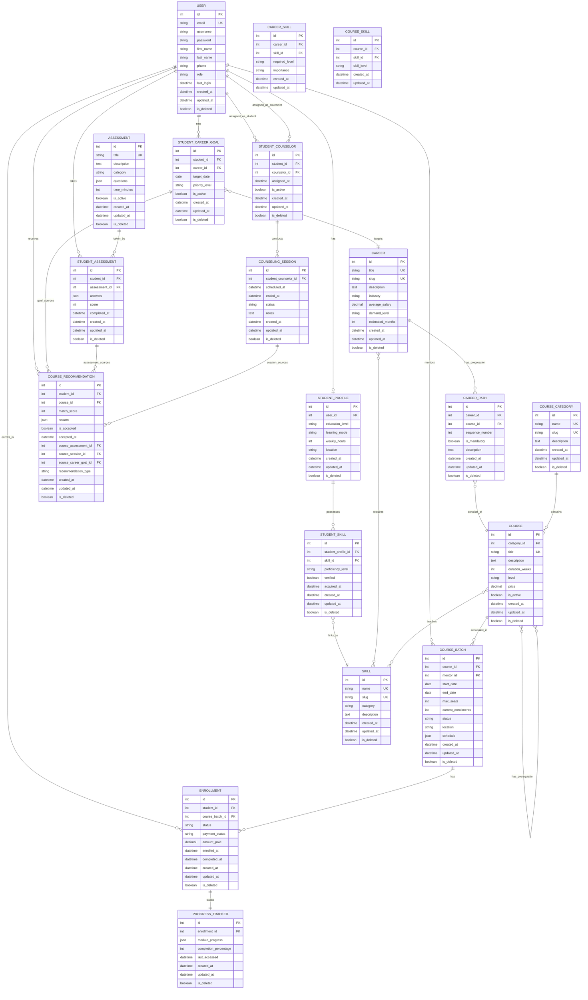

```mermaid

erDiagram
    USER ||--o| STUDENT_PROFILE : has
    USER ||--o{ STUDENT_ASSESSMENT : takes
    USER ||--o{ STUDENT_CAREER_GOAL : sets
    USER ||--o{ ENROLLMENT : enrolls_in
    USER ||--o{ COURSE_RECOMMENDATION : receives
    USER ||--o{ STUDENT_COUNSELOR : "assigned_as_student"
    USER ||--o{ STUDENT_COUNSELOR : "assigned_as_counselor"
    USER ||--o{ COURSE_BATCH : mentors

    STUDENT_PROFILE ||--o{ STUDENT_SKILL : possesses
    STUDENT_SKILL }o--|| SKILL : links_to

    STUDENT_CAREER_GOAL }o--|| CAREER : targets
    STUDENT_CAREER_GOAL ||--o{ COURSE_RECOMMENDATION : "goal_sources"

    CAREER }o--o{ SKILL : requires
    CAREER ||--o{ CAREER_PATH : has_progression
    CAREER_PATH }o--|| COURSE : consists_of

    COURSE_CATEGORY ||--o{ COURSE : contains
    COURSE }o--o{ SKILL : teaches
    COURSE ||--o{ COURSE_BATCH : scheduled_in
    COURSE }o--o{ COURSE : has_prerequisite

    COURSE_BATCH ||--o{ ENROLLMENT : has
    ENROLLMENT ||--|| PROGRESS_TRACKER : tracks

    ASSESSMENT ||--o{ STUDENT_ASSESSMENT : taken_by
    STUDENT_ASSESSMENT ||--o{ COURSE_RECOMMENDATION : "assessment_sources"

    STUDENT_COUNSELOR ||--o{ COUNSELING_SESSION : conducts
    COUNSELING_SESSION ||--o{ COURSE_RECOMMENDATION : "session_sources"

    USER {
        int id PK
        string email UK
        string username
        string password
        string first_name
        string last_name
        string phone
        string role
        datetime last_login
        datetime created_at
        datetime updated_at
        boolean is_deleted
    }

    STUDENT_PROFILE {
        int id PK
        int user_id FK
        string education_level
        string learning_mode
        int weekly_hours
        string location
        datetime created_at
        datetime updated_at
        boolean is_deleted
    }

    SKILL {
        int id PK
        string name UK
        string slug UK
        string category
        text description
        datetime created_at
        datetime updated_at
        boolean is_deleted
    }

    STUDENT_SKILL {
        int id PK
        int student_profile_id FK
        int skill_id FK
        string proficiency_level
        boolean verified
        datetime acquired_at
        datetime created_at
        datetime updated_at
        boolean is_deleted
    }

    CAREER {
        int id PK
        string title UK
        string slug UK
        text description
        string industry
        decimal average_salary
        string demand_level
        int estimated_months
        datetime created_at
        datetime updated_at
        boolean is_deleted
    }

    CAREER_SKILL {
        int id PK
        int career_id FK
        int skill_id FK
        string required_level
        string importance
        datetime created_at
        datetime updated_at
    }

    CAREER_PATH {
        int id PK
        int career_id FK
        int course_id FK
        int sequence_number
        boolean is_mandatory
        text description
        datetime created_at
        datetime updated_at
        boolean is_deleted
    }

    COURSE_CATEGORY {
        int id PK
        string name UK
        string slug UK
        text description
        datetime created_at
        datetime updated_at
        boolean is_deleted
    }

    COURSE {
        int id PK
        int category_id FK
        string title UK
        text description
        int duration_weeks
        string level
        decimal price
        boolean is_active
        datetime created_at
        datetime updated_at
        boolean is_deleted
    }

    COURSE_SKILL {
        int id PK
        int course_id FK
        int skill_id FK
        string skill_level
        datetime created_at
        datetime updated_at
    }

    COURSE_BATCH {
        int id PK
        int course_id FK
        int mentor_id FK
        date start_date
        date end_date
        int max_seats
        int current_enrollments
        string status
        string location
        json schedule
        datetime created_at
        datetime updated_at
        boolean is_deleted
    }

    ASSESSMENT {
        int id PK
        string title UK
        text description
        string category
        json questions
        int time_minutes
        boolean is_active
        datetime created_at
        datetime updated_at
        boolean is_deleted
    }

    STUDENT_ASSESSMENT {
        int id PK
        int student_id FK
        int assessment_id FK
        json answers
        int score
        datetime completed_at
        datetime created_at
        datetime updated_at
        boolean is_deleted
    }

    STUDENT_CAREER_GOAL {
        int id PK
        int student_id FK
        int career_id FK
        date target_date
        string priority_level
        boolean is_active
        datetime created_at
        datetime updated_at
        boolean is_deleted
    }

    STUDENT_COUNSELOR {
        int id PK
        int student_id FK
        int counselor_id FK
        datetime assigned_at
        boolean is_active
        datetime created_at
        datetime updated_at
        boolean is_deleted
    }

    COUNSELING_SESSION {
        int id PK
        int student_counselor_id FK
        datetime scheduled_at
        datetime ended_at
        string status
        text notes
        datetime created_at
        datetime updated_at
        boolean is_deleted
    }

    COURSE_RECOMMENDATION {
        int id PK
        int student_id FK
        int course_id FK
        int match_score
        json reason
        boolean is_accepted
        datetime accepted_at
        int source_assessment_id FK
        int source_session_id FK
        int source_career_goal_id FK
        string recommendation_type
        datetime created_at
        datetime updated_at
        boolean is_deleted
    }

    ENROLLMENT {
        int id PK
        int student_id FK
        int course_batch_id FK
        string status
        string payment_status
        decimal amount_paid
        datetime enrolled_at
        datetime completed_at
        datetime created_at
        datetime updated_at
        boolean is_deleted
    }

    PROGRESS_TRACKER {
        int id PK
        int enrollment_id FK
        json module_progress
        int completion_percentage
        datetime last_accessed
        datetime created_at
        datetime updated_at
        boolean is_deleted
    }

```